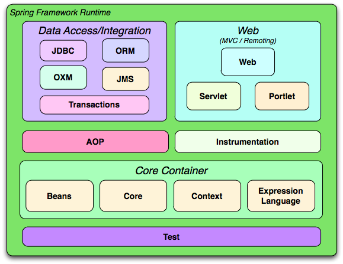
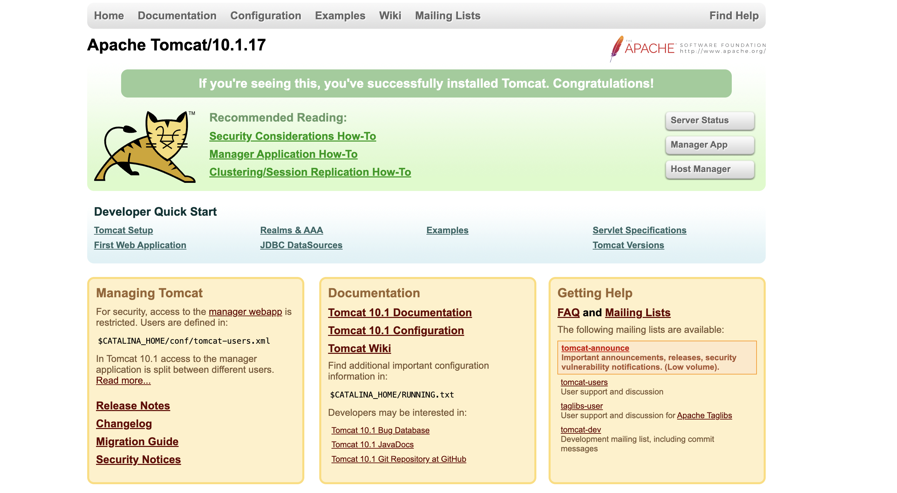

## Spring framework 아키텍처 다이어그램


가장 핵심은 Core Container

## ApplicationContext
- 스프링의 핵심 인터페이스 
- 대표적인 구현 클래스로 ClassPathXmlApplicationContext
    - classpath로부터 설정을 가져옴. -> classpath는 main의 java와 resources 폴더

## build.gradle 추가

-   implementation group: 'org.springframework', name: 'spring-context',version: '6.1.2'

위에 것만 추가해주면 Core Container의 모든 것을 가져온다.

## applicationContext.xml을 이용한 bean 등록


개발자가 직접 setter를 이용하여 주입
```
MyService myService = context.getBean("myService", MyService.class);
        MyDao myDao = context.getBean("myDao", MyDao.class);
        myService.setMyDao(myDao);
```
아래와 같음.

Spring 설정으로 인한 주입
~~~
    <bean id="myService" class="spring.component.MyService">
        <!-- setMyDao -->
        <property name="myDao" ref="myDao"></property>
    </bean>
    <bean id="myDao" class="spring.component.MyDao"></bean>
~~~

# Annontation을 이용한 Container
xml의 불편함 -> annotation을 이용한 컨테이너방식 등장

---

# Servlet이 실행되는 환경                                                                                                                                                                                                                       
## java EE에서 jakartaEE로 변환
https://www.samsungsds.com/kr/insights/java_jakarta.html

javax -> jakarta로 변경 

Java로 WebApplication을 구축 -> WAS 필요 (Servlet,JSP) 
-> Servlet 컨테이너
=> WAS에 포함(Apache Tomcat)

### tomcat 실행 및 확인
1. 톰캣 다운후 압축 풀기 
```
tar xvzf tomcat파일명 
```
2. -> bin 디렉토리 
```
./startup.sh
```

3. 명령어 ps -ef | grep java 를 통해 실행 확인
~~~
ps -ef | grep java

jar:/Users/nareun130/dev/was/apache-tomcat-10.1.17/bin/tomcat-juli.jar -Dcatalina.base=/Users/nareun130/dev/was/apache-tomcat-10.1.17
~~~

4. localhost:8080접속

5.  ./shutdown.sh 종료 
    - ※ 윈도우는 shutdown, startup + .bat파일을 실행

6. vi startup.sh 실행 i로 insert모드 

    1. 마지막줄 exec~ start@를에서 start를 run 으로 변경
    2. 그리고 satrtup.sh실행
    
    -> 실행내역이 나온다. 백그라운드x, 포어그라운드로 출력

## Tomcat이 기본으로 제공하는 Web Application
```
total 0
drwxr-x---@  7 nareun130  staff   224 12  8 08:31 .
drwxr-xr-x@ 16 nareun130  staff   512 12 22 17:51 ..
drwxr-x---@ 13 nareun130  staff   416 12  8 08:31 ROOT
drwxr-x---@ 61 nareun130  staff  1952 12  8 08:31 docs
drwxr-x---@  8 nareun130  staff   256 12  8 08:31 examples
drwxr-x---@  7 nareun130  staff   224 12  8 08:31 host-manager
drwxr-x---@  9 nareun130  staff   288 12  8 08:31 manager
```
---
## Tomcat 성공적 실행 
- http://localhost:8080/ 
    - Root WAS
- http://localhost:8080/docs 
    - docs
- http://localhost:8080/examples
    - examples webApplication
## examples 폴더
```
drwxr-x---@  8 nareun130  staff   256 12  8 08:31 .
drwxr-x---@  7 nareun130  staff   224 12  8 08:31 ..
drwxr-x---@  3 nareun130  staff    96 12  8 08:31 META-INF
drwxr-x---@  7 nareun130  staff   224 12  8 08:31 WEB-INF
-rw-r-----@  1 nareun130  staff  1126 12  8 08:31 index.html
drwxr-x---@ 21 nareun130  staff   672 12  8 08:31 jsp
drwxr-x---@ 11 nareun130  staff   352 12  8 08:31 servlets
drwxr-x---@  7 nareun130  staff   224 12  8 08:31 websocket
```

## Tomcat을 이용한 웹 앱을 만든다
http://localhost:8080
    - 내가 만든 사이트가 보여진다? -> Root폴더 수정
